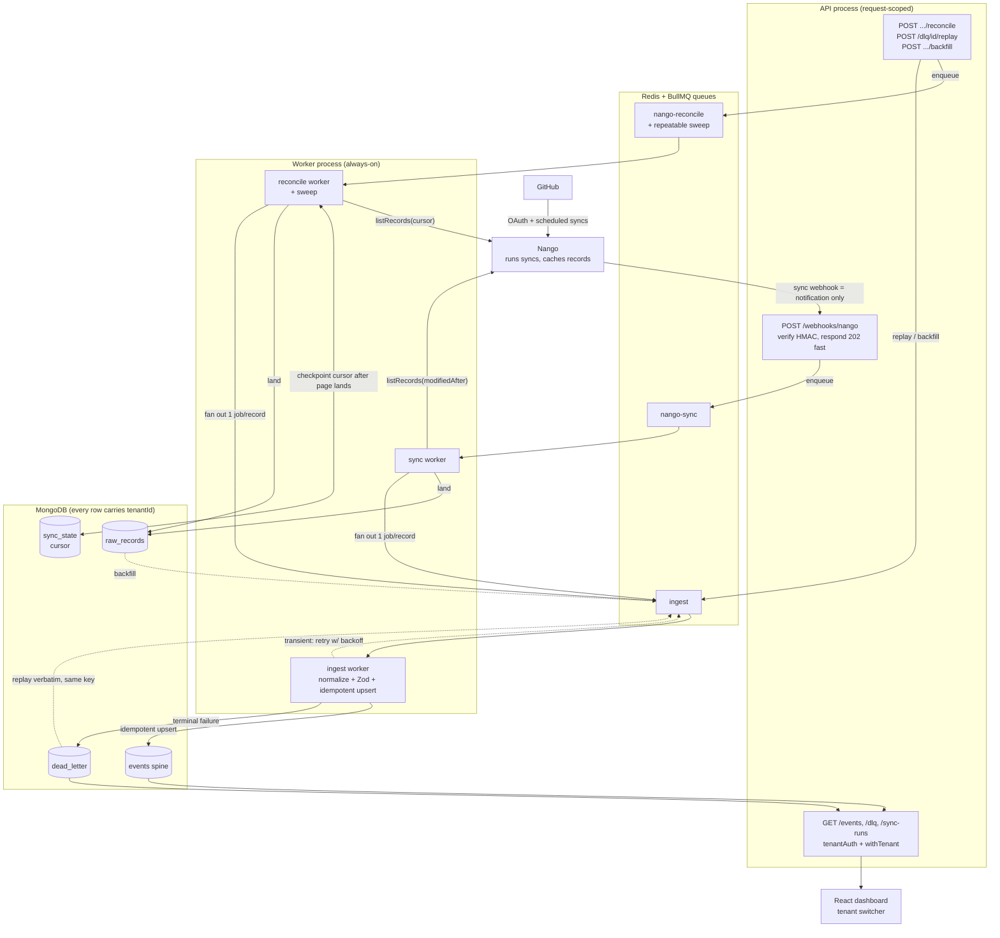

# shiplog-sync

A one-directional ingestion + resilience layer for [Shiplog](https://useshiplog.com),
built **on top of Nango** in MERN (TypeScript, run via tsx). Nango owns the GitHub
connection and base sync;
this layer turns Nango's per-source records into a unified, deduped, tenant-scoped
**event spine** with the enterprise guarantees: idempotent writes, dedup, retries +
backoff, a dead-letter queue, replay/backfill, hard multi-tenant isolation, and
observability.

> Direction is **source → store only** (GitHub into Shiplog). No write-back, no
> conflict resolution.

This repo is built in milestones. **All seven milestones (0–7) are complete** —
scaffold, idempotent event spine, BullMQ retry/backoff + DLQ, replay/backfill, real
Nango webhook ingestion, the reconciliation poller, a React dashboard, and a negative
multi-tenant isolation test. See [Roadmap](#roadmap).

---

## Why this shape

**Why build on Nango, not rebuild it.** Nango already solves the hard, boring parts of
integration — OAuth, the GitHub connection, the base sync, per-connection checkpoints,
and webhooks — reliably and across providers. Re-implementing that would re-solve a
solved problem. The engineering value is the layer Nango *doesn't* give you: your own
normalized, deduped, tenant-scoped event spine; idempotent writes into your store; your
dead-letter queue and replay for your *processing* failures; and application-level
tenant isolation in your database. So this prototype **drives Nango** for connect/extract
and builds that layer on top.

**Why one-directional (source → store, no write-back).** Data flows one way: GitHub
into the store, never back out. That matches the product shape — engineering output is
ingested to power downstream consumers — and it *removes* scope: with no write-back
there is no conflict resolution, no two-way merge, no echo-suppression. What's left are
the problems that actually matter here — correctness, dedup, resilience, and isolation.

**Why MERN — and how each piece maps to a production stack.** Built in MERN so every
resilience decision is hand-rolled and inspectable rather than hidden behind a managed
platform, and each component is a deliberate 1:1 analog of a typical Next.js / Postgres
/ Inngest stack, so the patterns port directly:

| This prototype (MERN) | Production analog | Why the pattern ports 1:1 |
|---|---|---|
| BullMQ + Redis (Upstash-compatible) | Inngest durable jobs | Retry/backoff, DLQ, and replay are the same durable-job patterns. *Nuance worth naming:* BullMQ retries **whole jobs**; Inngest checkpoints **steps** within a workflow. |
| Mongo + `tenantId` + the `withTenant` wrapper | Postgres/Drizzle + row-level security | App-level RLS ↔ engine-level RLS — the same "every query must carry the tenant filter" discipline (Mongo has no engine RLS, so the wrapper *is* the backstop). |
| Express `POST /webhooks/nango` (raw body + HMAC verify) | Next.js route handler / Server Action | The same signature-verified webhook receiver: verify, respond 2xx fast, enqueue — never process inline. |
| `raw_records` → `events` collections | raw → normalized tables | The same raw-then-normalize layering (à la Airbyte/Fivetran); raw is the immutable replay/backfill source. |
| Zod event contract (`z.infer` types) | Zod (the library Nango itself uses) | One typed schema as the single source of truth for runtime validation *and* static types. |
| BullMQ repeatable sweep | a scheduled durable job | The reconciliation cadence is a durable, retriable job — not a fire-and-forget `node-cron` tick. |
| reconciliation poller behind the webhook | the safety net behind any webhook source | Webhooks are "unreliable or incomplete" (Nango's own docs); the cursor-based poll re-delivers what a dropped webhook missed. |

---

## Quick start

Prereqs: Node ≥ 20, a local MongoDB on `mongodb://localhost:27017`, and (for
Milestone 2) a Redis on `redis://localhost:6379` — or any `REDIS_URL`, including an
Upstash `rediss://` URL. No Docker required.

```bash
npm install
cp .env.example .env        # MONGODB_URI, REDIS_URL (a local .env is already present)
npm run verify              # the Milestone 1 demo (below)
npm test                    # full test suite (queue integration tests skip if Redis is down)
npm run typecheck           # tsc --noEmit (TypeScript; the app itself runs via tsx, no build step)
```

### The Milestone 1 demo — idempotency no-op

```bash
npm run verify
```

Ingests the static Nango-shaped GitHub fixtures **twice** and prints the run counts:

```
Run 1 (first ingest):   added=6  updated=0  deleted=0  failed=0  unchanged=0
Run 2 (re-ingest):      added=0  updated=0  deleted=0  failed=0  unchanged=6

✓ Idempotency no-op verified: re-ingesting the same data added 0 and updated 0.
```

The second run is a no-op: the unique idempotency key makes re-running a sync (or,
later, replaying a DLQ item) safe. The script resets the demo tenant's `events` and
`sync_runs` first, so `Run 1 → added:6` is reproducible on every invocation.

### The Milestone 2 demo — failure → retry/backoff → DLQ

Ingestion now runs through a **BullMQ** `ingest` queue with a **separate worker
process**. Two terminals:

```bash
# terminal 1 — the worker (separate process from the API)
npm run worker

# terminal 2 — drive it
npm run enqueue            # the 6 fixtures flow through the queue into events
npm run inject transient   # 5xx-style error → retries with backoff → DLQ
npm run inject logical     # bad-payload error → straight to DLQ, no retry
npm run dlq                # inspect the dead_letter records
```

The worker log shows the retry path for a transient failure (exponential backoff
**with jitter**), then the dead-letter after attempts are exhausted:

```
[backoff] attempt 1 failed (transient) -> retry in 1020ms
[backoff] attempt 2 failed (transient) -> retry in 2125ms
[backoff] attempt 3 failed (transient) -> retry in 4520ms
[backoff] attempt 4 failed (transient) -> retry in 8774ms
[DLQ]  job 10 poison:transient -> dead_letter <id> after 5 attempt(s) [transient: injected transient failure]
```

A `logical` failure skips retries entirely and is dead-lettered after 1 attempt.
Retries are safe because the processor calls the same idempotent `ingestEvent` from
Milestone 1 — re-processing can't duplicate.

### The Milestone 3 demo — failure → DLQ → replay → no duplicate (the money shot)

```bash
npm run replay-demo
```

A single self-contained script (in-process worker + the real HTTP API) walks the
whole sequence and prints the proof:

```
Step 1  Ingest the record (worker healthy)
  event stored   _id            = 6a2ff95929ae6cc9bd983bf0
                 idempotencyKey = f435e97c8ec0…48efd
                 events = 1
Step 2  Simulate a downstream outage, re-send the SAME record (failure ON)
       [backoff] attempt 1 failed (transient) -> retry in 554ms
       … 5 attempts …
       [DLQ]  -> dead_letter … after 5 attempt(s)
                 events = 1   (unchanged — the failed attempt wrote nothing)
Step 3  Resolve the outage (failure OFF)
Step 4  POST /dlq/<id>/replay   (re-enqueues the original payload verbatim)
       [ok]   job 3 -> unchanged
                 _id            = 6a2ff95929ae6cc9bd983bf0   (SAME row)
                 idempotencyKey = f435e97c8ec0…48efd          (SAME key)
                 events = 1   (UNCHANGED — no duplicate)
Step 5  POST /connections/<id>/backfill   (reprocess from raw_records)
                 events = 1   (UNCHANGED — backfill is idempotent too)

✓ Replay used the same idempotency key and created no duplicate. One event, same row.
```

The proof is explicit: after replay the event has the **same `_id` and the same
idempotency key** as the baseline — literally the same row, and the replayed job
reports `unchanged`. "At-least-once delivery, idempotent consumer → effectively
once." The failure is an **external toggle** (not baked into the payload), so
`POST /dlq/:id/replay` re-enqueues the payload truly verbatim. (Conversely, an item
dead-lettered by the `npm run inject` *payload* poison will re-fail on replay — the
fault is in the payload, by design.)

### Milestone 4 — real Nango GitHub ingestion

**How it works.** Nango's sync webhook is a *notification* (it says "N records
changed for connection X / model Y"), not the records themselves. So:

```
Nango  ──webhook(sync notification)──▶  POST /webhooks/nango
                                          • verify X-Nango-Hmac-Sha256 (timingSafeEqual)
                                          • 202 immediately
                                          • enqueue a sync job
                                                   │
                                         nango-sync worker
                                          • nango.listRecords({model, modifiedAfter, cursor})
                                          • land raw_records + enqueue 1 ingest job per record
                                                   │
                                         ingest worker ─▶ normalize ─▶ idempotent upsert ─▶ events
```

So "one ingest job per record" happens in the **sync worker** (after the records
API call), not in the webhook — the webhook stays fast. A duplicated webhook is
harmless: same records → same idempotency keys → no duplicate events (at-least-once
delivery, idempotent consumer — **no webhook-dedup logic needed**).

**Try it locally without a Nango account** (fixture-backed; `NANGO_USE_FIXTURES`):

```bash
# .env: set NANGO_WEBHOOK_SECRET=anything   (so the signature can be verified)
npm run worker                       # terminal 1 (runs ingest + nango-sync workers)
npm start                            # terminal 2 (the API)
npm run connect nc-local github      # store a connectionId on the demo tenant
npm run simulate-webhook GithubIssue nc-local   # signs + POSTs a sync webhook
curl -H "Authorization: Bearer demo-api-key" http://localhost:3000/events
# -> 2 GithubIssue events flowed through the whole pipeline
```

**Wire real Nango (developer/cloud tier):**
1. **Integration** — in the Nango dashboard, create a GitHub *integration* (note its
   **integration id** = `providerConfigKey`) and enable a sync that produces records
   (e.g. a `GithubIssue` model).
2. **Connection** — authorize one GitHub *connection* (one per tenant). Note its
   **connection id**, then register it: `npm run connect <connectionId> <integrationId>`.
   This id must match exactly, or webhooks won't resolve to the tenant.
3. **Secrets** — put `NANGO_SECRET_KEY` (Environment Settings) and
   `NANGO_WEBHOOK_SECRET` (Environment Settings → Webhooks → **Signing key**) in
   `.env`, and make sure `NANGO_USE_FIXTURES` is **not** set. Restart the worker and
   confirm its boot log reads `Nango=live` (not `Nango=fixtures`) — otherwise it
   serves static fixtures and you'll see fake data that looks real.
4. **Webhook URL** — expose your local API and point Nango at it:
   ```bash
   ngrok http 3000
   # set the Nango webhook URL (Environment Settings → Webhooks) to:
   #   https://<your-ngrok-subdomain>.ngrok.app/webhooks/nango
   ```
5. **Verify** — trigger a sync in Nango (dashboard "Run sync", or push a commit/open
   an issue in the connected repo). Watch the worker log
   (`[nango-sync] … fetched N, enqueued N` → `[ok] … added`), then
   `GET /events` — the records are now normalized events.

**Two caveats worth knowing:**
- *Signature*: verification implements Nango's **documented** scheme (HMAC-SHA256 of
  the raw body, `X-Nango-Hmac-Sha256`, signing key) and is unit-tested against it —
  but it has not been validated against a live webhook. If real webhooks return 401,
  set `NANGO_DEBUG=true` to log computed-vs-received, or fall back to the SDK's
  `nango.verifyIncomingWebhookRequest`.
- *Record shape*: `normalizeGithubRecord` assumes a GitHub-API-ish field shape. If
  your sync's model differs, the record fails Zod validation → **lands in the DLQ
  with the raw payload**. Inspect it (`npm run dlq`), adjust the mapper to the real
  fields, and **replay** (Milestone 3) — no data lost.

---

### Milestone 5 — reconciliation poller (the webhook safety net)

Webhooks get dropped — Nango is down, your endpoint is redeploying, ngrok
hiccups. The poller is the backstop: it independently **polls** Nango's records
API on a durable cursor and re-delivers anything the webhook missed.

```
repeatable sweep (BullMQ job scheduler, every RECONCILE_EVERY_MS)
        │  fan out: one reconcile job per active connection × model
        ▼
reconcile worker  ─ load cursor from sync_state ─▶ nango.listRecords({model, cursor})
        │  land raw_records + enqueue ingest per record   (page by page)
        │  ✅ checkpoint: persist last record's cursor  ── ONLY after the page lands
        ▼
ingest worker ─▶ normalize ─▶ idempotent upsert ─▶ events
```

**The cursor invariant.** The cursor advances **only after** a page's records
are durably landed in `raw_records` (checkpoint-after-write, per page). If the
records fetch or a landing throws, the cursor stays where the last fully-landed
page put it, and BullMQ retries from there — never re-pulling all history, never
skipping a record. *Advances on success, holds on failure.*

A reconcile job uses a **deterministic jobId** (`reconcile:<connectionId>:<model>`)
so a manual trigger and a scheduled tick collapse onto one in-flight job instead
of racing the same cursor — the cursor stays single-writer.

> **Layering (stated precisely):** a cursor that advanced means records are
> durably in `raw_records` **and** an ingest job is enqueued — *not* that they're
> confirmed in the `events` spine. A record whose ingest later dead-letters is
> recovered via M3 replay/backfill. Reconcile is the **delivery** safety net;
> the ingest retry/DLQ is the **processing** one.

**Trigger it.** Scheduled automatically (the sweep, registered by the worker at
boot), or manually per connection:

```bash
curl -X POST -H "Authorization: Bearer demo-api-key" \
     http://localhost:3000/connections/<connectionId>/reconcile
# body {"model":"GithubPullRequest"} reconciles one model; omit it for all of
# the connection's models (Connection.models, default ["GithubIssue"])
```

**See both paths + the invariant** (fixture-backed; needs Mongo + Redis):

```bash
npm run reconcile-demo
# Path 1  signed webhook        -> 2 events
# Path 2  reconcile (API down)  -> retries w/ backoff, FAILS, cursor HELD at ∅
# Path 3  reconcile (recovered) -> cursor ADVANCES to c-102, no duplicate events
```

---

### Milestone 6 — the dashboard

A minimal **React + React Query** dashboard (Vite) that makes the whole pipeline
visible and operable from one page — and proves multi-tenant isolation by letting
you switch tenants and watch the data change with nothing leaking.

```bash
npm run seed                                 # two isolated demo tenants, with data
npm start                                    # terminal 1 — the API (:3000)
npm run worker                               # terminal 2 — the worker (jobs actually run)
cd dashboard && npm install && npm run dev   # terminal 3 — the dashboard (:5173)
# open http://localhost:5173
```

One page, five panels — all scoped to the selected tenant's API key:

- **Tenant switcher** — flips the API key every panel uses; switching from
  *Acme Storefront* (5 events, a DLQ item) to *Globex Industries* (3 events, clean)
  shows isolation at a glance. Every React Query key is namespaced by the active
  key, so one tenant's rows can never bleed into another's view.
- **Sync Control** — per connection, **Reconcile** (poll Nango on the durable
  cursor) and **Backfill** (reprocess `raw_records`) buttons.
- **Sync Runs** — status · added/updated/deleted/failed · duration · trigger.
- **Dead-Letter Queue** — each failed item with its error and a **Replay** button.
  Replay re-enqueues the payload verbatim and marks the row *replayed* (it stays
  listed); the re-flowed event appears in Events — same idempotency key, no dup.
- **Events** — the normalized spine with a total count.

The dashboard talks to the API through Vite's dev proxy (`/api/*` → `:3000`), so
there's no CORS to configure. It's a **separate package** (`dashboard/`) with its
own deps; the backend is untouched. The two demo API keys are baked into the client
(they're *demo* keys) rather than exposed by a cross-tenant endpoint — which would
itself break the isolation the dashboard exists to demonstrate.

> Prefer Bull Board for raw queue introspection? It can be mounted behind the
> tenant auth as a drop-in; the custom panels above were fast enough not to need it.

---

## Architecture (so far)

The whole system on one page — two delivery paths (push webhook + poll reconcile)
converging on a single idempotent ingest queue, then the deduped event spine,
with the DLQ/replay and raw/backfill loops:



The same ingest/DLQ/replay core, drawn closer in:

```
Nango-shaped records ─▶ raw_records ─▶ ingest queue (BullMQ) ─▶ worker (process)
                            │                                        │
                            │                        normalize ─▶ Zod ─▶ idempotent upsert
                            │                                        │
                            │                success ─────────────┐  │  ┌──── transient: retry
                            │                                      ▼  ▼  ▼      (backoff + jitter)
                            │                      events (deduped spine)   logical: no retry
                            │                            ▲                │
   POST /connections/:id/backfill ──────────────────────┘   terminal failure ▼
   (reprocess raw)                                              dead_letter (full context)
                                                                        │
                                       POST /dlq/:id/replay ◀───────────┘
                                       (re-enqueue verbatim → same key → no dup)
```

### Data model (MongoDB collections)

`tenants` · `connections` · `sync_state` · `raw_records` · `events` · `sync_runs` ·
`dead_letter`. Indexes: **unique** `{idempotencyKey}` on `events`;
`{tenantId, externalId}` and `{tenantId, occurredAt}` on `events`; and a **unique**
`{tenantId, connectionId, model}` on `sync_state` (one cursor row per
tenant × connection × model — the M5 single-writer cursor).

### Key design decisions

**Idempotency = append-per-version, not upsert-latest.**
`idempotencyKey = sha256(tenantId | source | externalId | version)`, with a unique
index. Each distinct source *version* is its own row, so:

- Re-ingesting the same version is a guaranteed no-op (unique-index backstop,
  even under concurrent workers).
- Replaying a *stale* version can never overwrite current state — it just lands (or
  no-ops) as history. This is what makes the **failure → replay → no-duplicate**
  demo (Milestone 3, the headline deliverable) correct rather than a silent state
  regression. An upsert-latest model would revert current state when a
  failed-then-replayed old version arrives.

**Replay re-enqueues the payload verbatim; backfill reprocesses raw_records.**
`POST /dlq/:id/replay` puts the dead-lettered item's original payload back on the
ingest queue unchanged — so the worker recomputes the *same* idempotency key and the
write is a no-op against the unique index ("safe because writes are idempotent").
`POST /connections/:id/backfill` re-enqueues every `raw_record` for a connection;
because ingestion is idempotent, re-running never duplicates. Both are
tenant-scoped (replaying another tenant's DLQ item is a 404).

**Content-hash dedup distinguishes a real update from a no-op.**
`contentHash` is computed over the *semantic* fields only (it excludes the `version`
token). A new version whose content is identical (e.g. a spurious `updatedAt` bump)
is suppressed as `unchanged`; only genuinely changed content counts as `updated` —
so dashboard counts reflect real change (à la Fivetran's `_fivetran_id`).

**Tenant isolation is application-enforced.** Every document carries `tenantId`, and
`tenantId` is part of the idempotency key. The consumption path — `GET /events` — reads
through the `withTenant(tenantId)` repository wrapper, which injects the tenant filter
into every query it issues: the app-level analog of Postgres row-level security (Mongo
has none at the engine level). The other tenant-scoped endpoints (`/connections`,
`/sync-runs`, `/dlq`) apply the same `tenantId` filter directly in their handlers. A
**negative isolation test** (`test/isolation.test.ts`) pins the wrapper: it proves
Tenant B cannot read Tenant A's events, and **fails if the `tenantId` filter is ever
dropped from `withTenant`**. (Folding all collections under the wrapper is listed under
Limitations, below.)

**Durable jobs with classified retries (Milestone 2).** Ingestion runs through a
BullMQ `ingest` queue processed by a **separate worker process**. An error
classifier decides retry policy (AWS guidance — only retry transient errors):

- **transient** (5xx / 429 / network) → retried up to 5 attempts with **exponential
  backoff + jitter**, honoring `Retry-After`. Jitter prevents synchronized retry
  storms.
- **logical** (Zod validation / bad payload / unmappable) → wrapped in BullMQ's
  `UnrecoverableError` and sent **straight to the DLQ, no retry** — you don't
  blindly retry a payload that will never get better.

On terminal failure the job is persisted to the `dead_letter` collection with full
context (payload, error stack, `attemptsMade`, timestamps, `tenantId`,
`connectionId`, `syncRunId`) and parked on a `dlq` queue for Milestone 3 replay.
Retries/replays are safe because the processor reuses the idempotent `ingestEvent`.

Secrets are never placed in job payloads (BullMQ stores `data` in cleartext) — jobs
carry only IDs and the public record.

**MERN as a deliberate 1:1 analog of a production stack.** Each choice maps directly to
a Next.js / Postgres / Inngest stack — see the [mapping table](#why-this-shape) at the
top (including the BullMQ-retries-whole-jobs vs. Inngest-checkpoints-steps nuance).

---

## Limitations & what I'd add for real scale

This is a prototype that demonstrates the patterns at small scale — not production
infrastructure. What I'd add next, roughly in priority order:

- **Consolidate every collection under the repository wrapper.** Today only the `events`
  consumption path goes through `withTenant`; the other tenant-scoped endpoints apply the
  `tenantId` filter inline in their handlers. A single wrapper covering all collections
  (with the negative test extended per collection) would make the mandatory-filter
  guarantee structural rather than per-handler.
- **True exactly-once via a transactional outbox.** At-least-once + an idempotent
  consumer is "effectively once" for these writes; a transactional outbox would close the
  gap for external side effects.
- **Observability export (OpenTelemetry).** `sync_runs` + structured logs cover run
  history and a DLQ-rate signal; a real deployment wants traces/metrics exported to a
  collector, with the DLQ-rate alert wired to paging ("alert on the rate, not presence").
- **Schema-drift handling.** Today a record whose shape the normalizer doesn't expect
  fails Zod validation and dead-letters (recoverable via replay). At scale you'd want
  drift detection and versioned mappers rather than dead-letter-and-fix.
- **Per-tenant rate-limit budgets** so one tenant's large backfill can't exhaust shared
  Nango/Redis capacity (per-tenant BullMQ job keys are the starting point).
- **More sources into the same spine.** Adding Jira or Linear is a new Nango integration
  plus a mapper into the existing `events` schema — not a rewrite.

A few honest caveats:

- **BullMQ ≠ Inngest exactly.** Inngest checkpoints *steps* within a workflow; BullMQ
  retries *whole jobs*. The patterns map, but the distinction is real.
- **Mongo has no engine-level row security.** Isolation here is application-enforced; on
  Postgres you'd use RLS as the engine-level backstop.
- **The Nango webhook signature** is implemented to Nango's documented HMAC scheme and is
  unit-tested, but has not been validated against a live webhook (see Milestone 4).

---

## Layout

TypeScript throughout, run directly with **tsx** (no build step); `tsconfig.json`
is `strict` + `isolatedModules`, type-check with `npm run typecheck`.

```
src/
  config/env.ts          # env config (dotenv)
  db/connect.ts          # mongoose connect/disconnect
  models/                # the 7 collections, with indexes + document interfaces
  types/express.d.ts     # augments Express Request with tenant / tenantId
  middleware/tenantAuth.ts   # API key -> tenantId
  repository/withTenant.ts   # tenant-scoped query wrapper (app-level RLS)
  normalize/github.ts    # Nango GitHub record -> typed event
  events/
    schema.ts            # NormalizedEventSchema (Zod) + z.infer types (one source of truth)
    hash.ts              # idempotencyKey + contentHash
    ingest.ts            # idempotent upsert + content-hash dedup
    raw.ts               # land raw_records (immutable raw / backfill source)
  queue/
    types.ts             # job-payload types (IngestJobData, ReconcileJobData, ...) + JobView
    connection.ts        # ioredis (Upstash-compatible)
    queues.ts            # ingest + dlq queues, default job options
    errors.ts            # TransientError/LogicalError + classifyError
    backoff.ts           # exponential backoff + jitter (pure)
    ingestProcessor.ts   # normalize -> idempotent ingest; classify failures
    deadLetter.ts        # terminal-failure detection + dead_letter persistence
    ingestWorker.ts      # Worker factory: backoffStrategy + failed -> DLQ
    nangoSyncWorker.ts   # Worker factory: fetch records -> fan out ingest jobs
    reconcileSweep.ts    # sweep fan-out + deterministic per-(conn,model) reconcile job
    reconcileWorker.ts   # Worker factory: sweep/reconcile dispatch + sweep scheduler
    replay.ts            # replayDeadLetter + backfillConnection
  nango/
    types.ts             # NangoRecord / NangoClientLike contract
    verify.ts            # X-Nango-Hmac-Sha256 verification (timingSafeEqual)
    client.ts            # @nangohq/node client (or fixture adapter)
    syncProcessor.ts     # listRecords -> land raw + enqueue per-record ingest (webhook)
    reconcileProcessor.ts # poll on sync_state cursor; checkpoint-after-write per page
  fixtures/github.ts     # static Nango-shaped GitHub records
  app.ts                 # Express app factory (webhook, /dlq, replay, backfill, reconcile, /connections)
  server.ts              # API entrypoint (queue producer)
  worker.ts              # worker entrypoint: ingest + nango-sync + reconcile (separate process)
scripts/                 # *.ts, run via tsx (npm run verify | seed | replay-demo | reconcile-demo | ...)
test/                    # vitest suite (*.test.ts, runs against a local test DB)
dashboard/               # M6: Vite + React + React Query dashboard (separate package, /api proxy → :3000)
```

### HTTP API

Public: `GET /health`; `POST /webhooks/nango` (Nango-signature authenticated).
Tenant-scoped (API key): `GET /events` · `GET /connections` · `GET /sync-runs` ·
`GET /dlq` · `POST /dlq/:id/replay` · `POST /connections/:id/backfill` ·
`POST /connections/:id/reconcile` · `POST /connections`

## Testing

Two tiers:

- **`npm test`** — unit + Mongo-integration tests against
  `mongodb://localhost:27017/shiplog-sync-test` (dropped per run; the demo DB is
  never touched). Deterministic and Redis-free, so it runs anywhere. The queue's
  logic — error classification, backoff, the processor, terminal-failure/DLQ
  detection — is fully covered here. The **negative tenant-isolation test**
  (`test/isolation.test.ts`) lives here too: it proves Tenant B cannot read Tenant A's
  events and fails if the `tenantId` filter is dropped from the `withTenant` wrapper.
- **`npm run test:integration`** — the live BullMQ retry→DLQ end-to-end test.
  Requires a reachable `REDIS_URL` (it self-skips if none is found). Kept separate
  because it depends on external infrastructure; on a rare worker-teardown exit
  (a Windows + Node + vitest-forks quirk, not a product bug), re-run it.

## Roadmap

- **M0 ✅** scaffold, models + indexes, tenant API-key middleware
- **M1 ✅** Zod event schema, unique idempotency index, idempotent upsert +
  content-hash dedup, fixtures, verify demo
- **M2 ✅** BullMQ pipeline: retry/backoff + jitter, error classifier, DLQ
  persistence, separate worker process, failure injection
- **M3 ✅** replay / backfill — `POST /dlq/:id/replay`, `POST /connections/:id/backfill`,
  raw layer, the failure → replay → no-duplicate demo
- **M4 ✅** real Nango GitHub integration — `POST /webhooks/nango` (HMAC verify),
  nango-sync worker (records API → per-record ingest), fixture-backed local mode
- **M5 ✅** reconciliation poller — BullMQ repeatable sweep + `POST /connections/:id/reconcile`,
  durable per-model cursor in `sync_state` that advances only after a page lands
- **M6 ✅** React + React Query dashboard (Vite): tenant switcher (isolation),
  sync control (reconcile/backfill), sync-runs, DLQ + replay, events — plus
  `GET /connections`, `GET /sync-runs`, and a two-tenant seed (`npm run seed`)
- **M7 ✅** README (design rationale, the stack-mapping table, limitations), the
  negative multi-tenant isolation test (`test/isolation.test.ts`), and a rehearsal
  checklist ([`DEMO.md`](DEMO.md))
